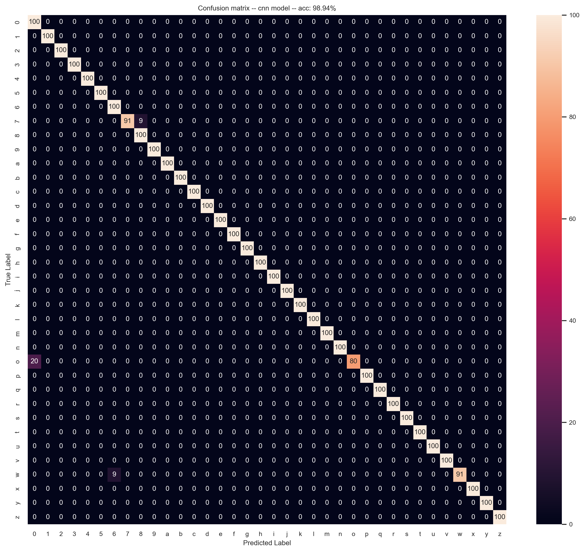

# Sign Language Classification using Deep Learning

## Introduction

Sign language is a crucial mode of communication for the deaf and hard-of-hearing community. It enables individuals to express themselves through hand gestures, facial expressions, and body movements. However, there is still a communication gap between sign language users and those unfamiliar with it. Automated sign language recognition using deep learning can help bridge this gap by enabling real-time translation into text or speech.

This project aims to classify sign language alphabets and digits using three different deep learning models: a Convolutional Neural Network (CNN), a Transfer Learning model based on ResNet18, and a Vision Transformer (ViT) model built from scratch. By comparing their performance, we aim to identify the most effective approach for sign language classification.

## Dataset

The dataset used for this project is the ASL dataset from Hugging Face, available [here](https://huggingface.co/datasets/Hemg/sign_language_dataset). It can also be found on Kaggle [here](https://www.kaggle.com/datasets/ayuraj/asl-dataset). The dataset has been split into three parts:

-   70% Training Set
-   15% Validation Set
-   15% Testing Set

## Models Overview

### 1. CNN Model

A Convolutional Neural Network (CNN) was developed from scratch to extract spatial features from sign language images. CNNs are particularly effective for image classification tasks due to their hierarchical feature extraction capabilities.

### 2. Transfer Learning with ResNet18

This model utilizes a pre-trained ResNet18 architecture with modifications to the fully connected layer to adapt to our classification task. We fully trained this model as it is relatively small yet effective for our case.

### 3. Vision Transformer (ViT)

A Vision Transformer (ViT) model was implemented from scratch to explore the potential of transformer-based architectures in image classification. Unlike CNNs, ViTs process images as sequences of patches, capturing global dependencies more effectively.

## Training Setup

All models were trained on a MacBook Pro M3's GPU (Metal). Training was conducted for a maximum of 100 epochs with an early stopping patience value of 20 epochs, meaning training was halted if no improvement was observed within 20 epochs after the last improvement.

## Model Performance

The table below summarizes the performance of each model, including test set accuracy, number of epochs required to achieve it, and total training time. The number of epochs listed for each model includes the 20 patience epochs.

| Model Type                   | Accuracy | Epochs | Training Time |
| ---------------------------- | -------- | ------ | ------------- |
| CNN                          | 98.94%   | 64     | 9min 6s       |
| ResNet18 (Transfer Learning) | 97.62%   | 39     | 8min 2s       |
| Vision Transformer           | 96.83%   | 81     | 19min 18s     |

## Confusion Matrices

Below are the confusion matrices for each model, providing insights into their classification performance.

### CNN Model Confusion Matrix



### ResNet18 Model Confusion Matrix


### Vision Transformer Model Confusion Matrix


Observations from the confusion matrices for each model:

-   CNN: The most confusion occurred between "o" and "O" (20%).
-   ResNet18 (TL):

    -   "o" was confused with "0" (20%).
    -   "0" was confused with "o" (9%).
    -   "5" was confused with "4" (20%).

-   ViT:

    -   "0" and "o" had mutual confusion (10% "o" with "0" and 9% "0" with "o").
    -   "5" was confused with "4" (30%).
    -   "6" was confused with "w" (27%).

## Conclusion

Based on the evaluation metrics, the best-performing model is **CNN**, which achieved the highest accuracy (98.94%) with relatively low training time. While the CNN model provides a strong baseline, the ResNet18 model benefits from pre-trained knowledge, and the Vision Transformer explores a novel approach to image recognition. However, the ViT model required significantly more training time.

Further improvements could involve hyperparameter tuning, data augmentation, or ensembling multiple models for improved accuracy.

---

## Requirements

-   Python 3.13
-   PyTorch 2.6
-   GNU Make (optional)

## Running the Model

Follow these steps to set up and run the model:

1. **Run `make setup`** to create the required folders and the virtual environment. If you don’t have GNU Make installed:

    - Manually create a virtual environment (`python3 -m venv .venv`).
    - Create the following folders at the root of the project:
        - `assets/models/` (to save trained models).
        - `assets/outputs/` (to save confusion matrices and loss plots).
    - Ensure that the Python path in the Makefile is correctly set to your Python interpreter (`python3`).

2. **Activate the virtual environment**:

    If the virtual environment is `.venv`:

    ```sh
    source .venv/bin/activate
    ```

3. **Install dependencies**:

    ```sh
    make install
    ```

    Alternatively, if Make is not installed:

    ```sh
    pip install -r requirements.txt
    ```

4. **Run the training or testing script**:

    ```sh
    python src/main.py -t --model_type [cnn,tl,vit] -m --mode [train,test] -s --save [best,last] -e --epochs [int] -lr --learning_rate [float] -p --patience [int] -f --print_freq [int]
    ```

    - `-t --model_type` _(Required)_: Choose between `cnn`, `tl` (transfer learning), or `vit`.
    - `-m --mode` _(Required)_: Set to `train` or `test`.
    - `-s --save`: Save either the `best` or `last` model.
    - `-e --epochs`: Number of training epochs.
    - `-lr --learning_rate`: Set the learning rate.
    - `-p --patience`: Number of patience epochs for early stopping.
    - `-f --print_freq`: Frequency of printing logs during training.

    Only the first two parameters (`--model_type` and `--mode`) are required. The default values for the other parameters can be found in the `Config` namespace in `utils.py`.

5. **Enjoy!** 🎉
